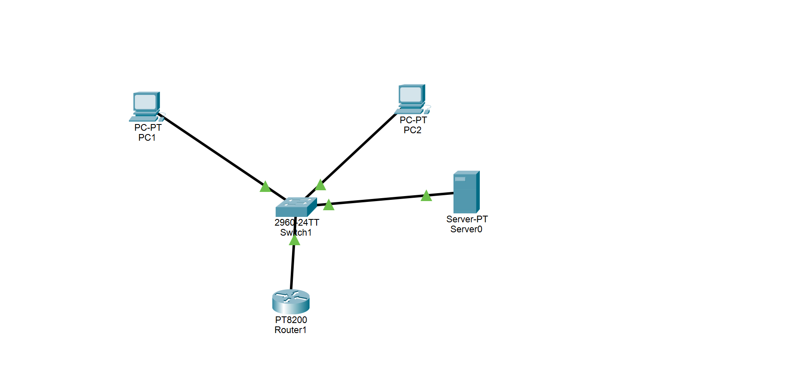

# Day 1 — Networking Foundations

**Date:** September 16, 2026  
**Roadmap:** Network + Infrastructure + CloudOps Engineering  
**Focus:** Networking Fundamentals

---

## 1. Topics Studied

Completed Jeremy's IT Lab — CCNA Day 1: Network Devices.

Topics covered:

- What is a computer network?
- Client
- Server
- Layer-2 switch
- Router
- Firewall
- Basic network communication

---

## 2. My Understanding

### Computer Network

A computer network is a group of devices that can communicate with each other and exchange information.

### Client

A client is a device that requests or receives information/services from another device.

### Server

A server is a device that provides services or resources to clients.

### Layer-2 Switch

A Layer-2 switch connects multiple devices within a local network (LAN) and forwards Ethernet frames between them.

### Router

A router connects different networks and forwards traffic between those networks.

### Firewall

A firewall controls and filters network traffic according to defined security rules.

---

## 3. Basic Network Flow

The basic communication path I learned:

```text
PC / Client
     |
   Switch
     |
   Router
     |
  Internet
```

---

## 4. Packet Tracer Practice

### Environment

- Cisco Packet Tracer

### Topology

Built a basic topology containing:

- 2 PCs
- 1 Server
- 1 Cisco 2960 Switch
- 1 Router

```text
PC1 ──────┐
          │
PC2 ─── Switch ─── Router
          │
Server ───┘
```

### Objective

Understand how endpoints, switches and routers fit together in a basic network.

### Practice Completed

- Identified PCs
- Identified the server
- Identified the switch
- Identified the router
- Connected the devices
- Observed the physical connections
- Practiced basic network connectivity

### Evidence


